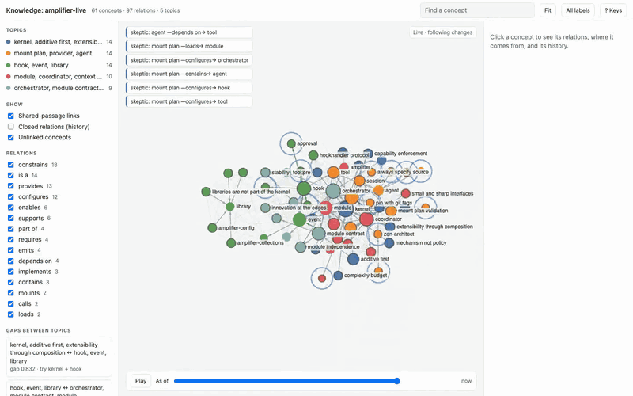
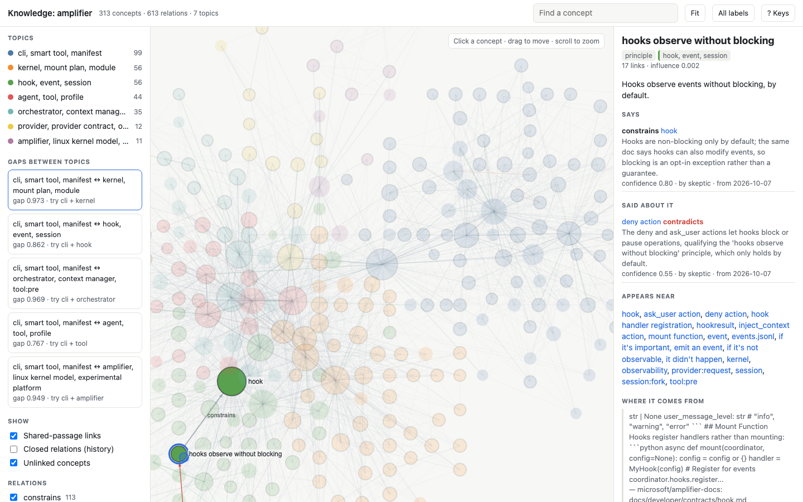
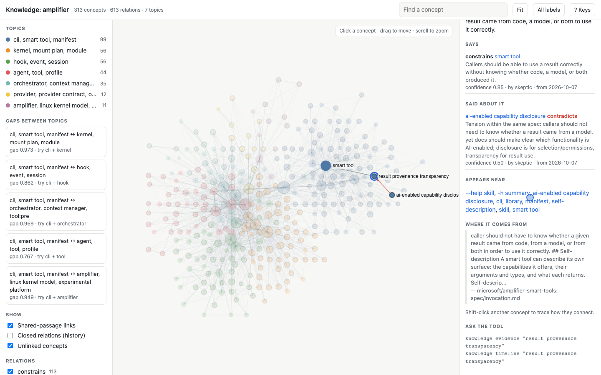
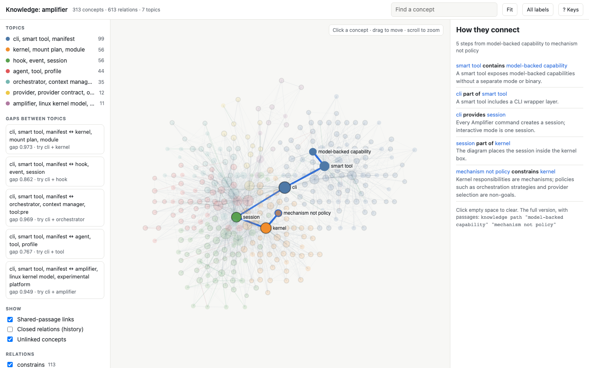
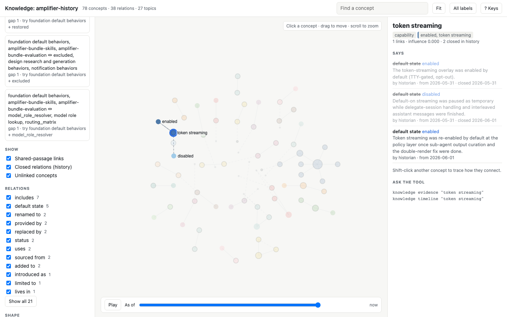
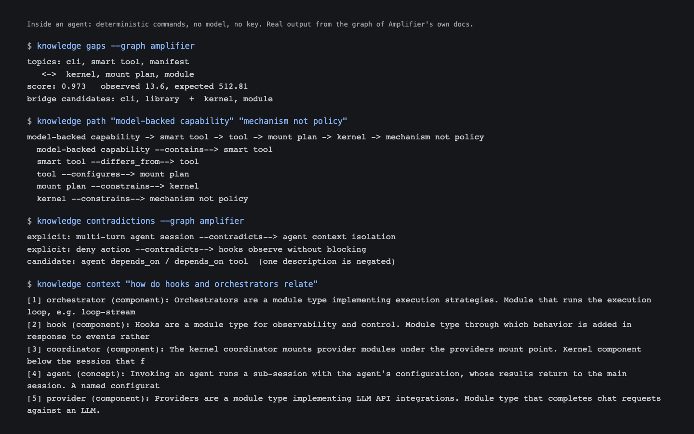
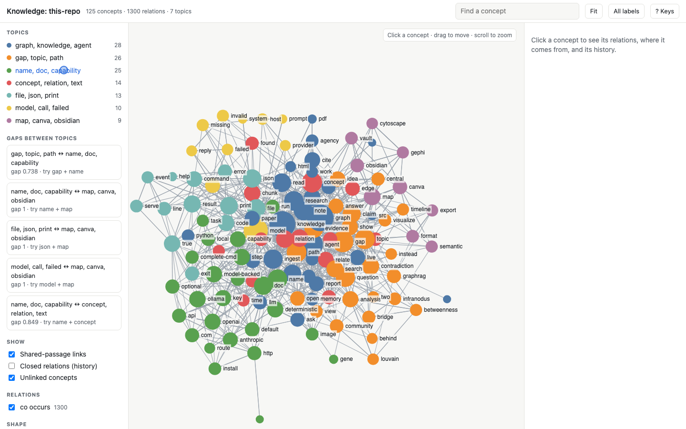

# knowledge

[](https://github.com/michaeljabbour/amplifier-smart-tool-visualizer/actions/workflows/ci.yml)
[](https://github.com/microsoft/amplifier-smart-tools/tree/main/conformance)
[](pyproject.toml)
[](pyproject.toml)
[](LICENSE)

**One knowledge graph your agents remember with, and you can explore.**

Point it at notes, papers, docs, code or agent sessions. You get a graph any agent can query and
add to: concepts and typed relations, each with the passage it came from, the agent that added it,
a confidence and the dates it held. Then trace how two ideas connect, check what supports or
contradicts a claim, find the gaps between topics, and replay how understanding changed.

It is an [Amplifier Smart Tool](https://github.com/microsoft/amplifier-smart-tools): a Python
library with a thin CLI and an optional MCP server, usable from Claude Code, Codex, Amplifier, a
script or any agent. Everything except five model-backed commands runs with no model and no key.

**[Product page and demos](https://michaeljabbour.github.io/amplifier-smart-tool-visualizer/)** ·
[One-minute trailer](docs/images/trailer.mp4) · [How it works](docs/VISION.md)



*Four Claude Code agents reading Amplifier's public docs and writing to one graph at the same time,
recorded live with `knowledge serve` (sped up).*

## Quick start (no model, no key)

```sh
uv tool install "amplifier-smart-tool-visualizer @ git+https://github.com/michaeljabbour/amplifier-smart-tool-visualizer"
knowledge doctor

knowledge ingest ./notes --method cooccurrence --graph notes   # a word network, no model
knowledge analyze --graph notes                                # central ideas, bridges, topics, gaps
knowledge visualize --graph notes --open                       # one self-contained page
```

With a model, `knowledge ingest ./notes` extracts typed concepts and relations instead (Anthropic,
OpenAI, a local Ollama model, or your own program through `--complete-cmd`). Inside an agent, the
agent is the model: `ingest --method agent` hands it the chunks and the extraction prompt, and it
writes back with `knowledge add`. No key is billed.

## What it found in Amplifier's own docs

The [example graph](examples/amplifier/) is real: twenty public documents from
[microsoft/amplifier-docs](https://github.com/microsoft/amplifier-docs) and the
[smart-tools spec](https://github.com/microsoft/amplifier-smart-tools/tree/main/spec), read by four
agents into 313 concepts and 613 relations, each citing an exact quote.

- **The biggest gap:** the smart-tools world (cli, smart tool, manifest) has almost no links to the
  kernel world (kernel, mount plan, module). `knowledge gaps` scores it 0.97 of a possible 1.
- **Tensions in the text:** the profiles guide says inheritance never removes parent features, then
  shows a profile that drops `tool-bash`. The tool contract says `execute()` returns `ToolResult`;
  its example returns dicts. The spec asks callers not to care whether a result came from a model,
  and also asks tools to say which capabilities use one. `knowledge contradictions` lists 13.
- **Beliefs that changed:** in [amplifier-foundation's history](examples/amplifier-history/), token
  streaming was enabled by default, paused as "temporary" the same day, and re-enabled the next.
  `knowledge timeline "token streaming"` shows all three, with the dates each held.

## Demos

| | |
|---|---|
| [](docs/images/gaps-demo.mp4) **Find the gaps.** Topics by colour; the gap list names the biggest holes and the concepts most likely to bridge them. | [](docs/images/evidence-demo.mp4) **Check a claim.** Supporting and contradicting relations in green and red, each with its quote, agent and date. |
| [](docs/images/path-demo.mp4) **Trace a line of reasoning.** Shift-click two concepts; the path follows typed relations, each with its sentence. | [](docs/images/time-demo.mp4) **Replay what changed.** Press Play; replaced decisions stay in the history, dashed. |
| [](docs/images/agent-demo.mp4) **Made for agents.** Plain commands, real answers, no key. | [](docs/images/words-demo.mp4) **No model at all.** This repository's docs as a word network. |

## Capabilities

| | Deterministic: no model, no key, same answer every time | Model-backed |
|---|---|---|
| Write | `ingest --method cooccurrence\|agent`, `add`, `relate`, `supersede` | `ingest` (default method) |
| Read | `search`, `show`, `path`, `timeline`, `evidence`, `context` | `ask` |
| Analyse | `analyze`, `communities`, `gaps`, `contradictions` | `report`, `questions`, `reconcile` |
| View and share | `visualize`, `serve`, `export`, `events` | |
| Setup | `stats`, `graphs`, `doctor`, `mcp`, `manifest` | |

- **Nothing is overwritten.** Every relation has the dates it held. `supersede` closes one in favour
  of a newer one, a changed file closes its old claims, and `--as-of DATE` reads the graph as it was.
- **Many agents, one graph.** Agents write through `add` and `relate` with their name on every
  relation; `events` is the change log and `serve` shows it live.
- **Take it anywhere.** `visualize` writes one HTML file with no outside requests. `export` writes
  JSON, Cytoscape, GraphML (Gephi), CSV, an Obsidian vault with wikilinks and a Canvas map.
- **For scripts and agents.** `--json` gives one envelope on stdout; exit codes 0, 1 (input), 2
  (usage), 3 (set something up), 4 (model call failed). It never prompts.
- **No surprise bills.** Inside Claude Code, Codex or Amplifier, model-backed commands stop with
  `host_model` and name the deterministic route instead of using an API key.

`knowledge --help` prints the tool's skill, written for an agent; `knowledge <capability> --help`
prints one capability in full.

## In Amplifier

The tool stays a plain CLI any harness can call; Amplifier gets it through a behavior:

```sh
amplifier bundle add 'git+https://github.com/michaeljabbour/amplifier-smart-tool-visualizer@main#subdirectory=behaviors/knowledge.yaml' --app
```

It loads the `knowledge` skill from `skills/`, which tells the agent to install the CLI and use the
deterministic routes. Optional: `behaviors/knowledge-mcp.yaml` serves the same capabilities as MCP
tools through Amplifier's MCP module (it needs `knowledge` on PATH; the file shows a `uvx`
alternative).

## As a library

The library is the tool; the CLI and MCP server are thin wrappers. Results are plain dicts.

```python
import knowledge as kg

kg.ingest("research", documents=kg.load_documents("./notes"), method="cooccurrence")
kg.relate("research", "experiment 14", "supports", "delegation reduces agency",
          source_type="evidence", target_type="claim", confidence=0.7, agent="researcher")
for p in kg.path("research", "delegation", "human agency")["paths"]:
    print(" -> ".join(p["nodes"]))

# your own model, no SDK needed
kg.ingest("research", text, complete=lambda system, prompt: my_model(system, prompt))
```

## Where the ideas came from

The core is [rahulnyk/knowledge_graph](https://github.com/rahulnyk/knowledge_graph): chunking, an
LLM extraction prompt, contextual proximity and communities, rebuilt as a smart tool with no runtime
dependencies. Around it are capabilities taken from Graphiti (temporal edges), InfraNodus
(centrality and structural gaps), Microsoft GraphRAG (community reports and local-search context),
Obsidian tools (vault and Canvas export) and Gephi. [docs/VISION.md](docs/VISION.md) maps every idea
to the file it lives in, and lists what was left out on purpose.

## Development

```sh
uv run --with pytest python -m pytest -q
uvx ruff check --isolated --line-length 132 --select E,F,W src tests
uv run path/to/amplifier-smart-tools/conformance/run.py .     # the spec's conformance kit
python3 scripts/build-examples.py                              # example graphs, no model
```

Read [AGENTS.md](AGENTS.md) before changing behaviour. [contracts/](contracts/) describes the CLI
envelope and the graph document; [site/](site/README.md) builds the product page and demos.

## License

MIT. Vendored and adapted third-party material, all MIT, is credited in [NOTICE](NOTICE).
